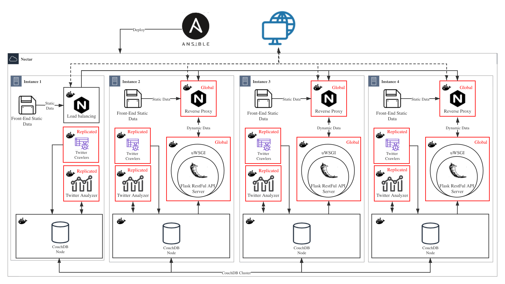

# City Analytics on the Cloud

A Cloud-based application that exploits a multitude of virtual machines (VMs) across the UniMelb Research Cloud (Nectar) for harvesting tweets through the Twitter APIs. The application also include a front-end interface for visualising our analysis and RESTFul API server for data accessing.


##   Project Demonstration Video

A Video is provided for project demonstration:
- Brief Edition: https://www.youtube.com/watch?v=bsROwtwk4J0&t=323s
- Full Edition: https://www.youtube.com/watch?v=LYTV-1LKQMo&feature=youtu.be

## Getting Started

### Prerequisites

*The VMs we use are provided by UniMelb Research Cloud (Nectar), which is based on OpenStack. And the Ansible playbook in `ansible/playbooks` mainly use OpenStack modules to create machines on the Instance Initialize Process. The following setting is based on UniMelb Research Cloud. You can change the code inside based on your cloud suppliers.*

#### Gain access from cloud providers

To gain access to UniMelb Research Cloud:

1. Login to https://dashboard.cloud.unimelb.edu.au. 
2. Download *openrc.sh* from Dashboard.
   * Make sure the correct project is selected
   * Download the OpenStack RC File
3. Reset API password
   * Dashboard -> User -> Settings -> Reset Password
4. Replace the `ansible/openrc.sh` with your own one. We suggest changing the `OS_PASSWORD` to your API password so that you don't have to input it every time.
5. Generate a ssh key pair in the cloud and put the private one to your `~/.ssh/`

#### Install Ansible

It is very easy for a Mac user to install Ansible. Homebrew is your best friend.

```
brew install ansible
```

For other operation system, you can check how to install it from [Installing Ansible Doc](https://docs.ansible.com/ansible/latest/installation_guide/intro_installation.html).

#### Set the Ansible variables to your own

1. Open `ansible/playbooks/variables/nectar.yaml` 
2. Change the `instance_key_name` in `line 30` to the name of your ssh key.
3. Change any other variable based on your personal need.

#### Prerequisites for local test (Optional)

This prerequisites is needed only if you want to get a development env to run our website application locally (We only provide a front-end application without analysis data accessing for local test). 

1. Install [Docker](https://docs.docker.com/get-docker/).
2. If you are using Linux, you need to also install [Docker-compose](https://docs.docker.com/compose/install/).

If you want to test the RESTFul server without docker, you need to:

1. Install [Python3](https://www.python.org/downloads/).

2. Install pip

3. Install the environment:

   ```shell
   cd src/server/restful_api_server
   pip install -r requirements.txt
   ```

## Test the Application Locally (Optional)

*We only provide a front-end application without analysis data accessing for local test.*

**You can test the front-end application by using docker-compose:**

* Run the command in your shell:

  ```shell
  cd src/server/restful_api_server
  docker-compose up --build
  ```

* Then open http://localhost:8080/.

**Or run the RESTFul server without docker:**

* Run the command:

  ```shell
  cd src/server/restful_api_server
  export FLASK_APP=run.py
  export FLASK_ENV=development
  flask run
  ```

* Then open http://127.0.0.1:5000/api/

## Deployment

If you set up the Prerequisites properly. The deployment would be very easy. We use Ansible to deploy our system. We also provide some script to simplify the command. But before running any command, if you are using the UniMelb Research Cloud, you need to connect to the Unimelb VPN.

You need to first enter the` ./ansible` dir and give permission to our script.

```
cd ansible
chmod 777 *.sh
```

If you want to run all in once:

```
./runAll.sh
```

If you want to run some tasks with specific tags:

```
./runWithTag.sh  <tag name>
```

If you want to reboot all the instances:

```
./reboot.sh
```

If you want to update the GitHub repo in the remote instances:

```
./gitPull.sh
```

If you want to delete all instances:

```
./testWithTag.sh all-delete
```

If you want to delete the data in the couchDB:

```
./testWithTag.sh db-rebuild
```

## RESTFul API Usage

We provide RESTFul APIs for accessing our analysis data. Since our server's IP can only be accessed within the Unimelb network, you need to connect to the Unimelb VPN before accessing our server. And they would not be accessible after the end of the 2020 semester one because the cloud resources are only available when we were taking this subject. We only provide analysis for five cities in Australia, which is Melbourne, Sydney, Brisbane, Adelaide and Perth.

Replace the`<city-name>` below with any one of `"melbourne", "sydney", "brisbane", "adelaide", "perth"` to access our RESTFul API.

* To gain map info of a specific city:

  http://172.26.132.125/api/v2.0/map/city/<city-name\>

* To gain city-level analysis of a specific city:

  http://172.26.132.125/api/v2.0/analysis/city/<city-name\>

* To gain suburbs-level analysis of a specific city:

  http://172.26.132.125/api/v2.0/analysis/suburbs-of-city/<city-name\>

* To gain all analysis include both city-level and suburbs-level of a specific city:

  http://172.26.132.125/api/v2.0/data/<city-name\>

* To gain all city-level analysis:

  http://172.26.132.125/api/v2.0/analysis/city-level/all

* To gain all suburbs-level analysis:

  http://172.26.132.125/api/v2.0/analysis/suburb-level/all


## The architecture of the system

## 

## Contributing

Please read [CONTRIBUTING.md](https://gist.github.com/PurpleBooth/b24679402957c63ec426) for details on our code of conduct, and the process for submitting pull requests to us.

## Authors

* [**Aaron Yau**](https://github.com/mgsweet) - 1101584  
* [**Rongbing Shan**](https://github.com/ShanRB) - 945388
* [**Tingli Qiu**](https://github.com/qiutingli) - 990497 
* [**Yawei Sun**](https://github.com/MarcoQQ) - 1050317  
* [**Aoqi Zuo**](https://github.com/aoqiz) - 1028089 

## License

This project is licensed under the MIT License - see the [LICENSE](LICENSE) file for details
